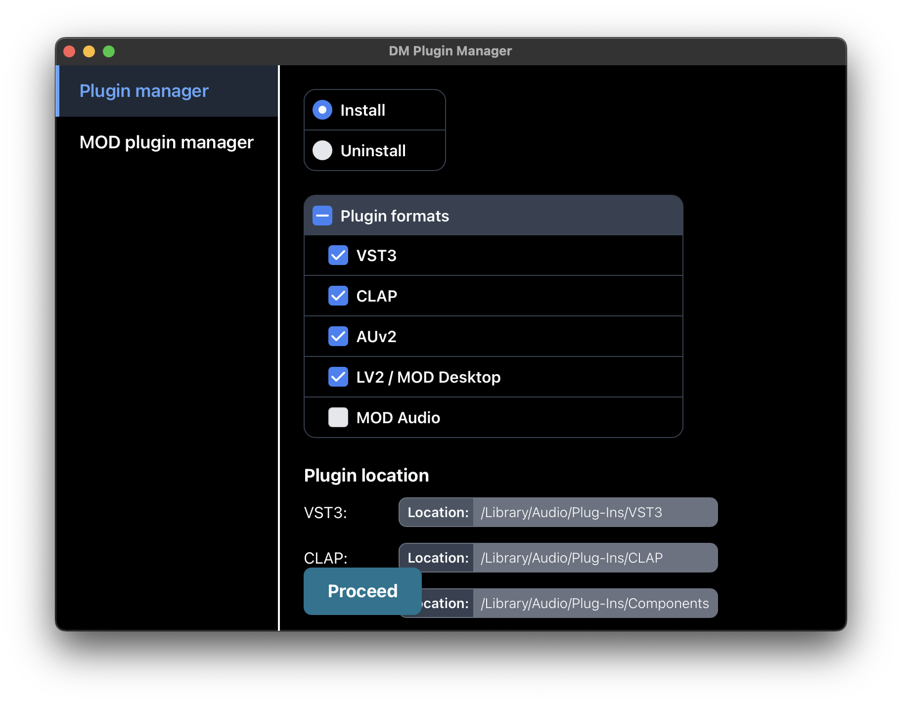
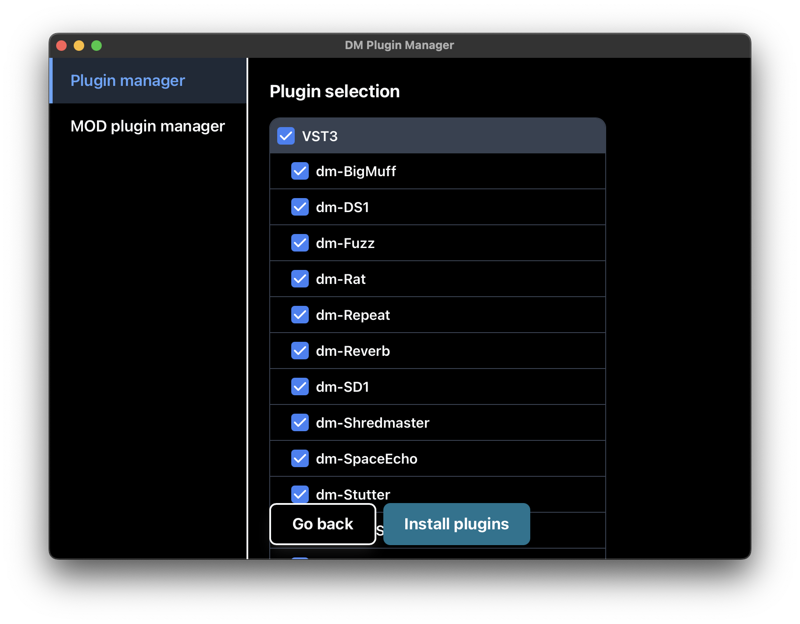
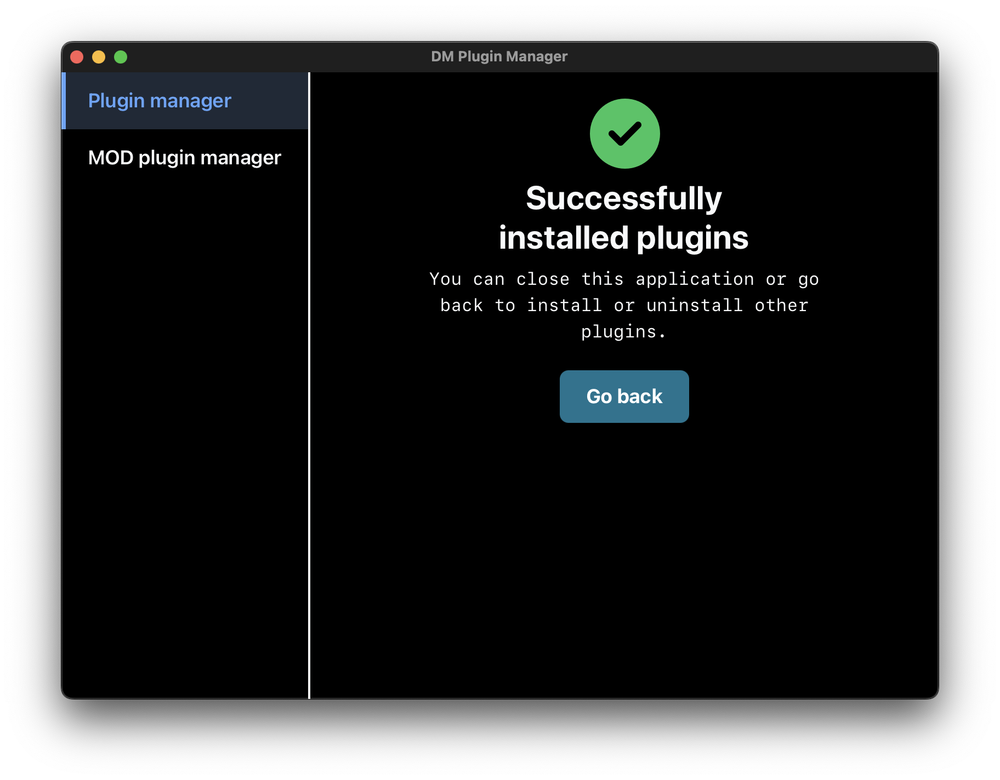

# DM Plugin Manager

**NOTE: DM Plugin Manager has been discontinued because requiring users to download an app installer is not ideal. It turns out using dedicated installers for each operating system is preferable. These will be available soon.**

| Install Page 1 | Install Page 2 | Install Page 3 |
|--------------|--------------|--------------|
|  |  |  |

With this Desktop app built with [Tauri](https://tauri.app/) you can install all DM audio effect plugins. This includes VST3, CLAP, Audio Unit, LV2 and MOD audio plugins. This app downloads the plugins from GitHub and copies it to the (potentially protected) plugin folder on your system. Or in case of MOD Audio; it copies it to the plugin folder on the hardware device through ssh. It's also possible to remove plugins by choosing uninstall. 

[Download the app for your operating system here](https://github.com/davemollen/dm-plugin-manager/releases).

## Development

Run `npm install` followed by `npx tauri dev` to start the application.
You might need to install cmake. Run this on macOS: `brew install cmake`.

### Add plugins

Available plugins are managed in the [dm-plugins.json file](./src-tauri/resources/dm-plugins.json)

### Release

1. Bump the versions in the [tauri.conf.json](./src-tauri/tauri.conf.json), [Cargo.toml](./src-tauri/Cargo.toml) and [package.json](./package.json) file.
2. Update the [release-notes.txt](./release-notes.txt)
3. Commit and push changes
4. Publish the release on Github when ready
